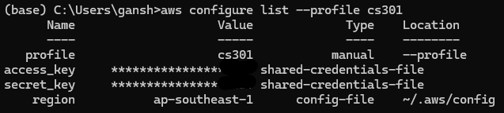
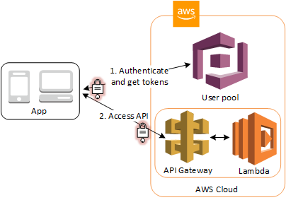
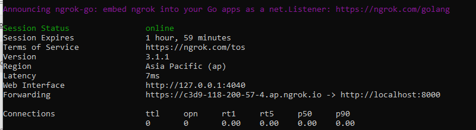
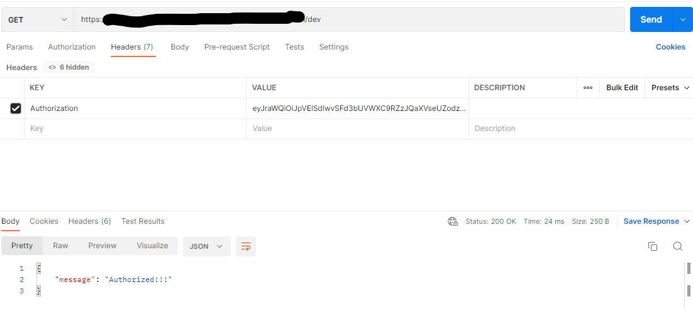
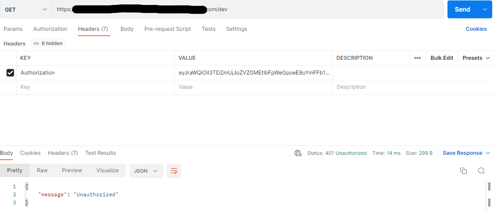
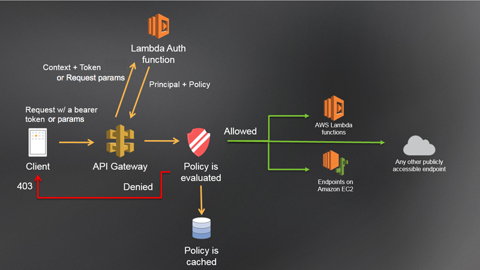
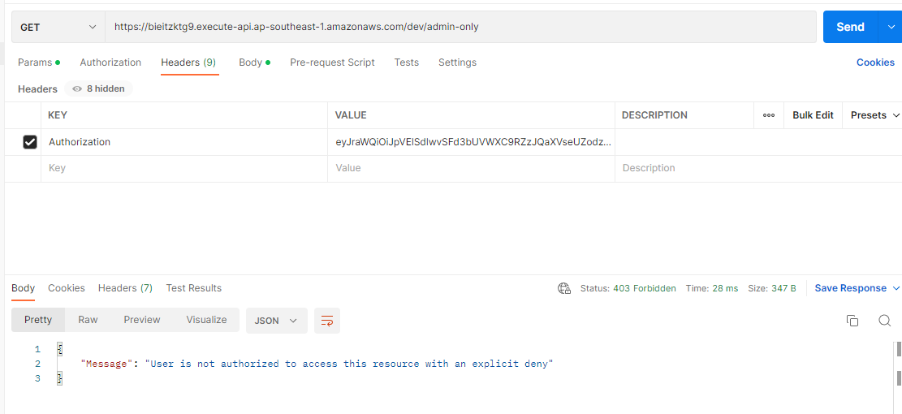
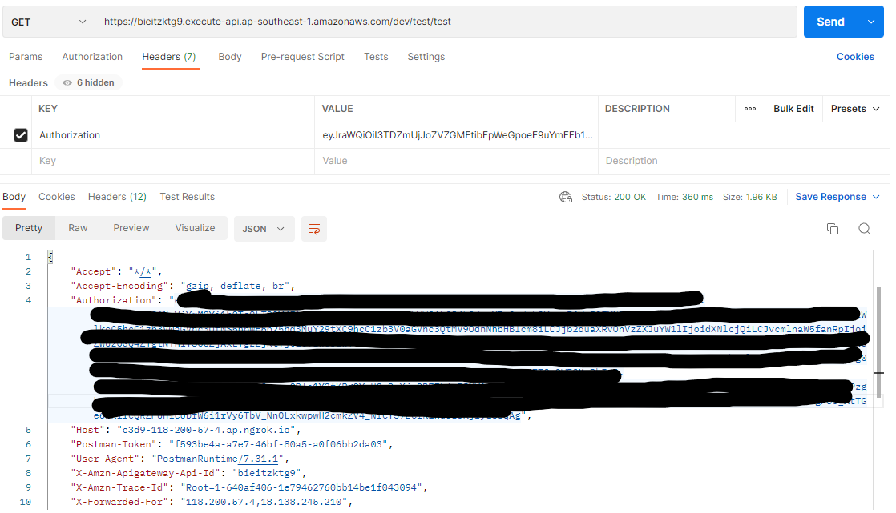
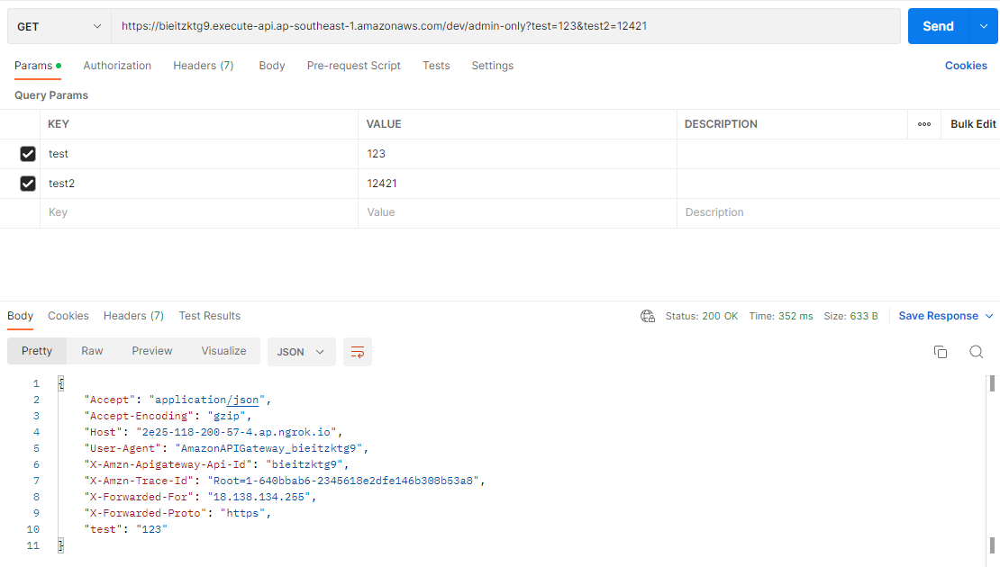

# allaboutaws
Useful Aws Tutorials and Documentations

## Prerequisite 
Most of the below examples are experimented in `AWS Academy Leaner Lab`. Hence do **configure** your own IAM roles/users to allow the use of the various AWS resources.

We will be using the following for the creation of AWS services:
- IAM role
    - asd
- PEM file
    - `EC2` -> `Network & Security` -> `Key Pairs` -> `Create key pair`
        - **Name:** cs301-aws-generic
        - **Private key file format:** .pem
- AWS CLI Named Profile
    - **Named profile:** cs301
    - We will not be using Learner Lab for any local deployment codes as it requires AWS Cli to be setup
- Local python packages
    - Create new python environment
    ```sh
    python -m venv .venv
    ```
    - Activate environment
    ```sh
    # Windows
    .venv\Scripts\activate

    # Mac/Linux
    source .venv/bin/activate
    ```
    - Install required libraries
    ```sh
    pip install -r requirements.txt
    ```

<details>
<summary>AWS CLI Configuration Simple Guide (<b>NOT</b> Learner Lab) </summary>

1. Install AWS Cli based on your operating system.
    - [Download installer](https://docs.aws.amazon.com/cli/latest/userguide/getting-started-install.html)
2. Since this is not our main aws account, we can configure as a named profile and be part of our profile collection. Otherwise, just `aws configure` is suffice if you want a quick setup and assign the the values as your main credentials
    ```sh
    aws configure --profile <profile-name-of-your-choice>
    # AWS Access Key ID [None]: AKIAI44QH8DHBEXAMPLE
    # AWS Secret Access Key [None]: je7MtGbClwBF/2Zp9Utk/h3yCo8nvbEXAMPLEKEY
    # Default region name [None]: us-east-1
    # Default output format [None]: text
    ```
3. You can check the output by giving the command `aws configure list`
    
4. Do note that if you are using a named profile, you have to specify the profile whenever you use an aws resource
    - for e.g.
    ```python
    import boto3

    # Include this line to attach profile to a session
    boto3.setup_default_session(profile_name='dev') 

    boto3.resource('s3') # and so on and so forth
    ```

Below is a list of useful commands for your development
- aws --version
- aws configure list
- aws configure set < key > < value >
- aws configure get < key >
- aws configure list-profiles


</details>

## Examples 
<details>
<summary>Public and Private Subnet </summary>

  <!-- weight = "" height = "" -->

### Summary
We will be creating a 
- 1 vpc *(IP address of 10.0.0.0/16)* to allow **65534** hosts (256*256 - 2)
- 1 public subnet *(IP address of 10.0.1.0/24)* to allow **254** hosts (256 - 2)
- 1 private subnet *(IP address of 10.0.2.0/24)* to allow **254** hosts (256 - 2)

The key difference between a private and a public subnet is that private subnet associated with a route table that **doesn’t have a route to an internet gateway**.

### Implementation Steps

**NOTE:** You can click **VPC and more** to create a new VPC with 2 public and 2 private subnet configured automatically for you. Click [here](./static/aws-create-vpc-and-more.png) to see the visualisation!


1. Create VPC
    - `VPC (service)` -> `Virtual private cloud (left navigation menu)` -> `Your VPCs` -> `Create VPC`
        - **Name:** vpc-demo
        - **IPv4 CIDR:** 10.0.0.0/16
2. Create Subnet for both private and public
    - `VPC (service)` -> `Virtual private cloud (left navigation menu)` -> `Subnets` -> `Create subnet`
        - **VPC ID:** <select your VPC from (1)> 
        - **Subnet name:** subnet-public-1, subnet-private-1
        - **Availability Zone:** us-east-1a , us-east-1b *(you can allow AWS to choose for you but I assign manually for better control of resources later on)*
        - **IPv4 CIDR block:** 10.0.1.0/24 , 10.0.2.0/24 respectively
        - CLICK `add new subnet` to add more
3. Create a new Internet gateways
    - `VPC (service)` -> `Virtual private cloud (left navigation menu)` -> `Internet gateways` -> `Create internet gateway`
        - **Name tag:** demo-internet-gateway
    - Click on your gateway, from `Actions` -> `Attach to VPC` 
        - **Available VPCs**: <select your VPC from (1)> 
4. Create Route tables for your private and public subnets
    - Do note that a default route table is already attached during the creation of VPC. In this case we will be using the **default route table for the private subnet** since it is not routed to any internet gateway.
        
    - Change the name of the default route table for the private subnet
        - `VPC (service)` -> `Virtual private cloud (left navigation menu)` -> `Route tables`
        - Find the default route table that is under your vpc and hover your mouse-tip to the `-` under the `Name` column.
            - **Edit Name:**: rt-private-1
    - Create route table for public subnet
        - `VPC (service)` -> `Virtual private cloud (left navigation menu)` -> `Route tables` -> `Create route table`
            - **Edit Name:**: rt-public
            - **VPC:** <select your VPC from (1)> 
        - Once created, click on `Edit Routes` and `Add route`
            - **Destination:** 0.0.0.0/0
            - **Target:** Click `Internet Gateway` and you will see the gateway that you have attached in (3)
5. Change the route table for your public subnet *(private subnet should already be attached to the default route table which you renamed at (4))*
    - `VPC (service)` -> `Virtual private cloud (left navigation menu)` -> `Subnets`
    - Click on your public subnet *(subnet-public-1)*
    - Under `Route table`, click `Edit route association` and change the route table ID
        - **Route table ID:**: rt-public
6. Enable DNS hostname in VPC - allow public DNS hostname (if not you have to create eastic IP address for every resource)
    - Check this StackOverFlow [here](https://stackoverflow.com/questions/20941704/ec2-instance-has-no-public-dns)
    - `VPC (service)` -> `Virtual private cloud (left navigation menu)` -> `Your VPCs`
    - Click on your VPC and `Actions` -> `Edit VPC settings`
    - Check Enable DNS hostname
7. Auto-assign public IPv4 address for your public subnet
    - `VPC (service)` -> `Virtual private cloud (left navigation menu)` -> `Subnets`
    - Click on your public subnet and `Actions` -> `Edit subnet settings`
    - check `Enable auto-assign public IPv4 address`
8. YAY! you have successfully setup a private and a public subnet under your own VPC! You can visualise the resource map by clicking on your `VPC`. From the image below, you can see that the two different subnets are associated with different route table. Only the public subnet can access the internet gateway.
    


</details>

<details>
<summary>Database Creation (private) and Connections</summary>

### Summary


We will be creating a private PostgreSQL DB RDS instance (Learnerlab do not have access AWS Aurora) and will be connecting to it through our local laptop using a proxy (EC2). 

**NOTE:** Do setup your vpc and subnets as from `Public and Private Subnet` section as we will be using them in our implementation.

### Implementation Steps
1. Create Proxy (EC2) in public subnet
    - `EC2 (service)` -> `Instances (left navigation menu)` -> `Instances` -> `Launch instances`
        - **Name:** ec2-proxy
        - **Amazon Machine Image (AMI):** Amazon Linux 2 AMI (free tier eligible)
        - **Instance type:** t2.micro (free tier eligible)
        - **Key pair name:** cs301-aws-generic *(check prerequisite)*
        - Click **Edit** under Network settings
        - **VPC:** vpc-demo *(created from `Public and Private Subnet` section)*
        - **Subnet:** subnet-public-1 *(created from `Public and Private Subnet` section)*
        - **Auto-assign public IP:** Enable
        - **Firewall (security groups):** Create security group (selected) 
        - **Security group name:** proxy-ec2-sg
2. Create DB subnet group 
    - Before that, create another private subnet as DB subnet group need to cover at least 2 AZs. Follow `Public and Private Subnet` section
    - `RDS (service)` -> `Subnet groups (left navigation menu)` -> `Create subnet group`
        - **Name:** private-db-subnet
        - **VPC:** vpc-demo *(created from `Public and Private Subnet` section)*
        - **Availability Zones:** us-east-1b, us-east-1c *(where our private subnets are)*
        - **Subnets:** 10.0.2.0/24, 10.0.3.0/24 *(created from `Public and Private Subnet` section)*
3. Create RDS instance
    - `RDS (service)` -> `Databases (left navigation menu)` -> `Create database`
        - **Engine type:** PostgreSQL
        - **Templates:** Free Tier
        - **DB instance identifier:** demo-db
        - **Master username:**: postgres **(Unchanged)**
        - **Master password:**: < password >
        - Under `Connectivity`
        - **Compute resource:**: Don't connect to an EC2 compute resource (selected) -> **we will manually set up**
        - **Virtual private cloud (VPC):** vpc-demo *(created from `Public and Private Subnet` section)*
        - **DB subnet group:** private-db-subnet *(created in step 2)*
        - **Public access:** No
        - **VPC security group (firewall):** private-db-sg
        - Under `Additional configuration` (Optional)
            - **Initial database name:** < db name >

4. Modify Security Group for your proxy and RDS
    - `EC2 (service)` -> `Network & Security (left navigation menu)` -> `Security Groups`
        - Click on the security group under the name you have assigned for your proxy in step 1 **(proxy-ec2-sg)**
            - Under `Outbound rules`, click on `Edit outbound rules` and add
                - **Type:** Custom TCP *(or you can just specific your database and it will update the port range as well)*
                - **Port Range:** 5432 *(PostgreSQL - change accordingly to your db)*
                - **Destination:** private-db-sg *(Security group created in step 3)* *(Alternatively, you can specify the rds instance IP directly)*
        - Click on the security group under the name you have assigned for your RDS in step 3 **(private-db-sg)**
            - Under `Inbound rules`, click on `Edit inbound rules`
                - remove existing rules and add:
                - **Type:** Custom TCP *(or you can just specific your database and it will update the port range as well)*
                - **Port Range:** 5432 *(PostgreSQL - change accordingly to your db)*
                - **Destination:** proxy-ec2-sg *(Security group of ec2)* *(Alternatively, you can specify the ec2 instance IP directly)*
    - This allows your proxy to add as a bastion host to connect with the RDS in your private subnet
5. Test Connection using Dbeaver
    - Establish **SSH Tunneling** to connect the RDS instance in the private subnet to your EC2 to local machine
        ```sh
        ssh -i testinstance.pem -4 -N -L randomlocalport:DB-endpoint:DB-port username@PublicIPAddress

        # For example
        ssh -i cs301-aws-generic.pem -4 -N -L 8003:demo-db.cmkdoo9tbsig.us-east-1.rds.amazonaws.com:5432 ec2-user@ec2-34-200-231-59.compute-1.amazonaws.com
        ```
        - Explaination of command: [here](https://explainshell.com/explain?cmd=ssh+-i+testinstance.pem+-4+-N+-L+randomport%3ADB-endpoint%3ADB-port+username%40PublicIPAddress)
    - You can check if the tunnel is established by listening to the port that you set above:
        ```sh
        netstat -ntap tcp | grep -i LISTEN | grep portnumber

        # For example
        netstat -ntap tcp | grep -i LISTEN | grep 8003

        # Sample output
        # tcp        0      0 127.0.0.1:8003          0.0.0.0:*               LISTEN      105/ssh
        ```
        - Explaination of command: [here](https://explainshell.com/explain?cmd=netstat+-ntap+tcp+%7C+grep+-i+LISTEN+%7C+grep+8003)
    - You can then connect to the rds instance through the local port you have set
        

</details>

<details>
<summary>NAT Gateway </summary>

Learner Lab **does not allow** the creation of NAT Gateway. But we can also access the internet from a private subnet

1. Make sure that your private subnet and public subnet are in the same availability zone.
2. Create a NAT Gateway in the public subnet
3. Edit the route table for your private subnet and add the followings:
    - **Destination:** 0.0.0.0/0
    - **Target:** nat-gateway-id

If we do not wish to use NAT Gateway, we have to set up a reverse proxy to forward the HTTP requests. This include setting up an ec2 instance in the public subnet and having installing apache to do the reverse proxy. Reference source can be found [here](https://serverfault.com/questions/569626/how-to-set-up-port-forwarding-on-amazon-ec2).


</details>


<details>
<summary>AWS Cognito -Userpool </summary>

<p align="center" width="100%">
    
</p>

### Summary
In this demonstration, we will be setting up user pool and retrieving the tokens via Native Api (boto3). After which, we create an Api Gateway which consists of both cognito authorizer and a custom lambda authorizer.

### Implementation Steps
1. Set up user pool *(without hosted UI)*
    - Settting up user pool is quite straightforward. Do refer to this [link](https://docs.aws.amazon.com/cognito/latest/developerguide/cognito-user-pool-as-user-directory.html) for the various options that AWS provides.
    - For this example, we will be doing the followings (else stay default):
        - **Cognito user pool sign-in options:** User name
        - **MFA enforcement:** No MFA *(speed up sign in process at the risk of security)*
        - **Self-service account recovery:** Unchecked Self-service account recovery *(we will not be using the hosted UI)*
        - **Self-registration:** Unchecked self-registration *(we will not be using the hosted UI)*
        - **Allow Cognito to automatically send messages to verify and confirm - Recommended:** Unchecked *(Since we are creating fake user account, we will be using lambda or api to confirm user account instead)*
        - Include
        - Under `Custom attributes - optional`, [Name, Type, Min - optional, Max - optional, Mutable]
            - Add username, string, 2, 10, NOT mutable
            - Add test, string, 1, 50, mutable
        - **Email provider:** Send email with Cognito *(for dev purposes)*
        - **User pool name:** dev-pool
        - **App client name:** dev-app-public *(client secret should be unchecked by default)*
        - Under `Advanced app client settings`:
            - Include **ALLOW_USER_PASSWORD_AUTH** in `Authentication flows`
2. We can either setup users/groups in AWS console UI or creating them via python sdk (faster).
    - Full list of commands can be found >[here](https://boto3.amazonaws.com/v1/documentation/api/latest/reference/services/cognito-idp.html)<
    - There are helper functions set up for you in [aws.py](./scripts/utils/aws.py) for faster creation of users/groups. Alternatively, you can create via the console UI.
3. There are two ways to manage users in user pool and get authentication tokens, either through **Hosted UI (OIDC API)** or **Amazon Cognito user pools API (Boto3 python in this case)**. The difference between the two is that we can set `custom scope` for OIDC API whereas a fixed scope: `aws.cognito.signin.user.admin` is assigned for native API like boto3. Full explanation can be found [here](https://docs.aws.amazon.com/cognito/latest/developerguide/user-pools-API-operations.html).
    - Hosted UI (OIDC API)
        - Since we did not configure any Hosted UI in step 1, we have to create a cognito domain for our Hosted UI authentication endpoints.
            - Click on your userpool and navigate `App integration` -> `Domain` -> `Action` -> `Create Cognito Domain`
        - We can either get the access_token by logging in through the hosted UI or using [Amazon Cognito Identity SDK](https://www.npmjs.com/package/amazon-cognito-identity-js), [AWS JWT Verify](https://github.com/awslabs/aws-jwt-verify). Detailed documentation can be found >[here](https://developer.amazon.com/docs/login-with-amazon/authorization-code-grant.html#server-apps)<
        - Flow: Get authorization Code -> get Access token -> get Identity token
        - *Demonstration example pending*
    - Native API (Boto3)
        - Configure config.json and .env file
            - Change the **username** and **password** in [config.json](./scripts/utils/config.json) file under `cognito.get_token.AuthParameters`
            - Set **COGNITO_CLIENT_ID** and **COGNITO_CLIENT_SECRET** (if applicable) in [.env file](./scripts/.env.example)
            - Rename `.env.example` to `.env` to follow along the next few steps and prevent any unnecessary commit/push to github thereafter.
        - Helper script: aws.py
            - As mentioned, there are some helper functions which is from the boto3 documentation. You can get/refresh/revoke token using this script.
            ```sh
            usage: aws.py [-h] [--resource RESOURCE] [--action ACTION] [--config CONFIG] [--env ENV] [--s3profile S3PROFILE]
                        [--verbose]

            options:
            -h, --help            show this help message and exit
            --resource RESOURCE   Supported resource: cognito
            --action ACTION       Supported action: get_token, refresh_token, revoke_token
            --config CONFIG       Config file relative to aws.py
            --env ENV             Environment file relative to aws.py
            --s3profile S3PROFILE
                                    S3 Session for local development
            --verbose             Print everything
            ```
        - Get Access Token
            - `COGNITO_REFRESH_TOKEN`, `COGNITO_ACCESS_TOKEN`, `COGNITO_ID_TOKEN` will be saved in your environment file if response is successful.
            ```sh
            # Sample code
            python scripts\utils\aws.py --resource cognito --action get_token --config config.json --env ../env --s3profile cs301 --verbose 
            ```            
        - Refresh Access Token
            - `COGNITO_ACCESS_TOKEN`, `COGNITO_ID_TOKEN` will be saved in your environment file if response is successful.
            ```sh
            # Sample code
            python scripts\utils\aws.py --resource cognito --action refresh_token --config config.json --env ../env --s3profile cs301 --verbose 
            ``` 
        - Refresh Revoke Token
            ```sh
            # Sample code
            python scripts\utils\aws.py --resource cognito --action revoke_token --config config.json --env ../env --s3profile cs301 --verbose 
            ``` 
4. Create a simple API gateway for testing `(Serverless Authentication and Authorization)`. A simple walkthrough can be found >[here](https://aws.amazon.com/premiumsupport/knowledge-center/api-gateway-cognito-user-pool-authorizer/)< 
    - Set up Api Gateway. Do refer to `API Gateway` section for further details on setting up an Api gateway and authorizers. The following endpoints are:
        ```sh
        /
        GET                 # Mock endpoint, Cognito Authorizer                         (1)
        POST                # Mock endpoint, Cognito Authorizer                         (2)
            /admin-only     
            GET             # api/0/test endpoint from aws.py, Custom lambda Authorizer (3)
            POST            # api/0/test endpoint from aws.py, Custom lambda Authorizer (4)
                /all
                GET         # api/0/test endpoint from aws.py, Custom lambda Authorizer (5)
            /test
                /{proxy+}
                ANY         # api/0/ endpoint from aws.py, Cognito Authorizer           (6)
        ```
        - In this demonstration, we will be using mainly the (1),(2),(3),(5) to showcase the authorization process between AWS Cognito and AWS Api gateway.
        - For the custom lambda authorizer, the code can be found in [custom-auth](./scripts/custom-auth/). To set up a lambda function:
            - Zip the codes. The below command will install the dependencies in the `custom-auth/package` directory, zip the whole custom-auth folder and the zip file will be stored in `scripts/output` folder.
                ```sh
                python scripts/utils/general.py --action zip --in-dir ../custom-auth --out-dir ../output/custom-auth --deploy-lambda
                ```
                - Go to AWS lambda UI console and upload the zip file. 
                - Under `Configuration` -> `Environmental variables`, set the following environment variables:
                    - ENV -> *(PRODUCTION)*
                    - AWS_REGION
                    - COGNITO_USER_POOL_ID
                    - COGNITO_CLIENT_ID
            - Funtionalities:
                - Authenticate tokens manually. Can only use `access_token` as **client_id** is needed for the validation process
                - Only users in `test-g1` group will have access to `/admin-only` endpoint. All users will have access to the others (5).
        - Create Authorizers with `Authorization` as the token source.
        - For mock endpoints (1) and (2), configure the response output to be `{"message": "Authorized!!!"}`
            - Set `aws.cognito.signin.user.admin` as **OAuth Scope** for mock endpoint (1)
        - For the endpoints in our [custom flask api](./scripts/flask_main.py), we will be deploying it with ngrok to get a public proxy to our localhost port
            - Install [ngrok](https://ngrok.com/download) to create a proxy to our localhost temporary. 
            - Run flask_main.py and create a proxy to the local port
                ```sh
                # Run Flask app
                python scripts/flask_main.py

                # Start Ngrok
                ngrok http 8000     # since app is running on port 8000
                ```
            - Use the proxy url from ngrok for Endpoint URL in API Gateway - *in this case: https://c3d9-118-200-57-4.ap.ngrok.io*
                
            - `api/0/test` endpoint will mainly print out all **query values**, **json values**, **headers values** as well as any possible **kwangs** that are send to the endpoint. 


5. **(ENDPOINT (1) & (2))** You will find that you will get the result: `{"message": "Authorized!!!"}` if you include the correct token for the authorization headers for both GET and POST endpoint respectively. 
    - Scenario: provide access token to GET endpoint *(success)* - NOTE: rmb you have set **OAuth Scope** for this
        
    - Scenario: provide identity token to GET endpoint *(Fail)*
        
6. **(ENDPOINT (3) & (5))** Every users in the userpool can access `Endpoint (5)` but only those in **test-g1** group can access `Endpoint (3)`. These configurations are set in the custom lambda authorizer.
    - Workflow:
        
    - Scenario: user NOT in test-g1 accessing endpoint 3 (DENY)
        

</details>


<details>
<summary>AWS Api Gateway </summary>

*pending~*
1. Creating an Api Gateway: `Api Gateway (service)` -> `Create API`
    - `Choose an API type`: HTTP API, WebSocket API, REST API, REST API Private
        - We will be focusing on **REST API** for normal use cases and **REST API Private** if you want to connect to a private API in your VPC.
        - `Resources`: path attached to the domain
        - `Methods`: Different API method pertaining to the resource. *(ANY is a special keyword to represent all methods)*
    - Proxy Integration
        - Cannot do body mapping for Integration Response
2. Authorizer
    - Click on your api gateway and go to `Authorizers (left menu)` -> `Create new Authorizer`
        - **Name:** dev-authorizer-1
        - **Type:** Cognito
        - **Cognito User Pool :** *Click on the user pool that you have created*
        - **Token Source:** Authorization
    - As payload and headers are passthrough from the API gateway to the endpoint, we can get the ACCESS_TOKEN or the ID_TOKEN via the `Authorization` header. *(NOTE: This does not apply to custom authorizer!)*
        
    - Authentication and Authorization
        - By doing **OAuth2 Authentication**, you are using the **access token** to authenticate your identity as well as to authorize access to the various endpoints based on the scope provided. You will be setting **OAuth Scope** for in your endpoint.
        - Whereas if you are using the **identity token** to authenticate, AWS will just check whether the credentials matches those in the user pool **(openid authentication)**. You will **NOT** be setting any **OAuth Scope** for this.
3. Custom Configuration
    - Get Request
        - Do remember to include the various queries in request resources
        
    - Mock endpoints

    - Map authorizor's claims to headers
        - Normal Authorizer
            - You can obtain the claims by mapping to headers via `context.authorizer.claims`. Do note that context can only accept string or int values.The following are valid mapping for the headers:
                - context.authorizer.claims.sub
                - context.authorizer.claims.token_use
                - context.authorizer.claims.cognito:username
        - Customized Authorizer
            - The output format for the authorizer is as follows, where you will be saving your claims under context
                ```sh
                {
                    policyDocument, 
                    principalId=claims['sub'], 
                    context={
                        "test1": claims['username']
                    }
                }
                ```
            - You can obtain your context by mapping to headers via `context.authorizer`. Do note that context can only accept string or int values. The following are valid mapping for the headers:
                - context.authorizer.test1 


Create awpi gateway that can only be access from your vpc privately -create an interface VPC endpoint
https://docs.aws.amazon.com/apigateway/latest/developerguide/apigateway-private-apis.html#apigateway-private-api-create-interface-vpc-endpoint

Api with private integration - using vpc link
https://docs.amazonaws.cn/en_us/apigateway/latest/developerguide/getting-started-with-private-integration.html
https://medium.com/swlh/aws-api-gateway-private-integration-with-http-api-and-a-vpc-link-602360a1cd84
https://manurana.medium.com/tutorial-connecting-an-api-gateway-to-a-vpc-using-vpc-link-682a21281263
https://stackoverflow.com/questions/32671394/can-i-specify-http-endpoint-in-a-vpc-as-resource-in-aws-api-gateway
https://docs.aws.amazon.com/apigateway/latest/developerguide/set-up-private-integration.html
https://devops.stackexchange.com/questions/254/how-to-only-allow-api-gateway-requests-to-reach-our-ec2-instances

Mapping
https://docs.aws.amazon.com/apigateway/latest/developerguide/api-gateway-mapping-template-reference.html#input-variable-reference
https://docs.amazonaws.cn/en_us/apigateway/latest/developerguide/how-to-method-settings-execution-console.html

pass claims to header:
https://stackoverflow.com/questions/45631758/how-to-pass-api-gateway-authorizer-context-to-a-http-integration
https://docs.aws.amazon.com/apigateway/latest/developerguide/apigateway-enable-cognito-user-pool.html

Validate claims
https://docs.aws.amazon.com/apigateway/latest/developerguide/http-api-jwt-authorizer.html

output policy
https://docs.aws.amazon.com/apigateway/latest/developerguide/apigateway-resource-policies-examples.html
https://docs.aws.amazon.com/apigateway/latest/developerguide/api-gateway-lambda-authorizer-output.html

Custom Authorizer
https://www.alexdebrie.com/posts/lambda-custom-authorizers/
https://github.com/aws-samples/amazon-cognito-api-gateway/tree/80ee4cd9933c4362e30c62a9e52ac5b880d340b6
https://github.com/DMalliaros/aws-python-lambda-authorizers
https://docs.aws.amazon.com/apigateway/latest/developerguide/api-gateway-lambda-authorizer-output.html
How custom authorizer works:
https://docs.aws.amazon.com/cognito/latest/developerguide/amazon-cognito-user-pools-using-tokens-verifying-a-jwt.html
https://docs.aws.amazon.com/apigateway/latest/developerguide/apigateway-use-lambda-authorizer.html


</details>


<details>
<summary>CS301 Research Implementation </summary>

### Summary
The research focuses on evaluating the efficiency of processing large csv files and inserting into a Postgres database through:
1. Recurring Lambda function
2. AWS GLUE

Since this is just a research, there are quite alot of hard-coded values which we should not be doing in real production!

### Implementation Steps (Brief)
1. Recurring lambda function (reference [here](https://medium.com/swlh/processing-large-s3-files-with-aws-lambda-2c5840ae5c91))
    - Lambda does not provide 3rd party libraries out of the box. We have to zip the files and upload the lambda codes.
    - Zip the psycopg2 folder of your choice together ([awslambda-psycopg2 Github repo](https://github.com/jkehler/awslambda-psycopg2)) with the lambda handler code found [here](./scripts/research_lambda_handler.py)
    - Remember to increase the default time limit to 15 minutes.
2. AWS Glue
    - Attached an Amazon S3 endpoint to the VPC. Check [here](https://docs.aws.amazon.com/glue/latest/dg/connection-S3-VPC.html) for more details.
    - Create Crawler to get s3 files and process columns
    - Establish connection with Postgres database and create Crawler as well
    - Copy/upload the python script and create job. [Glue script](./scripts/research_glue_etl_test.py)

### Results - Lambda
The usual practice of ingesting data from a large CSV file is to send records to a message queue and allow the processing of each record to run asynchronously. The team simulated this environment by invoking an AWS Lambda function to open the CSV file and create a generator to receive each row. These rows are processed and sent to the database. 

As each lambda function has a maximum duration limit of 15 minutes, the function regularly checks if the remaining time is more than the stipulated time (defined by us) after each row retrieval. Another lambda function will be invoked asynchronously with the same event object and the additional offset value. This offset value helps to determine the last position of the processed records. 

<p align="center" width="100%">
    
    
</p>

The whole process took approximately 28 minutes for 478,817 records. The team reckons that the duration will increase as the processing algorithm gets more complex. 

### Results - Glue
The entire CSV file is processed and only sent to the database once all algorithms run successfully. The insertion of  478,817 records took approximately 3 seconds and the glue job took approximately 3 to 5 minutes. 

<p align="center" width="100%">
    
    
</p>


</details>


## Resources and References

<details>
<summary>AWS Docs</summary>

- [AWS Api Gateway: Integration Request with Authorizer claims in Api Gateway](https://docs.aws.amazon.com/apigateway/latest/developerguide/apigateway-enable-cognito-user-pool.html)
- [AWS Api Gateway: Resource policies](https://docs.aws.amazon.com/apigateway/latest/developerguide/apigateway-resource-policies-examples.html)
- [AWS Cognito: Access scope integration with AWS Cognito and AWS Api Gateway](https://docs.aws.amazon.com/apigateway/latest/developerguide/apigateway-create-cognito-user-pool.html)
- [AWS Cognito: Caching tokens](https://docs.aws.amazon.com/cognito/latest/developerguide/amazon-cognito-user-pools-using-tokens-caching-tokens.html)
- [AWS Cognito: JWT Authorizer](https://docs.aws.amazon.com/apigateway/latest/developerguide/http-api-jwt-authorizer.html)
- [AWS Cognito: Resource servers](https://docs.aws.amazon.com/cognito/latest/developerguide/cognito-user-pools-define-resource-servers.html)
- [AWS Cognito: Setting up user pool](https://docs.aws.amazon.com/cognito/latest/developerguide/cognito-user-pool-as-user-directory.html)
- [AWS Cognito: Token Endpoint](https://docs.aws.amazon.com/cognito/latest/developerguide/token-endpoint.html)
- [AWS Cognito: Using the Amazon Cognito native and OIDC APIs](https://docs.aws.amazon.com/cognito/latest/developerguide/user-pools-API-operations.html)
- [AWS Glue: Connection in AWS Glue Data Catalog](https://docs.aws.amazon.com/glue/latest/dg/glue-connections.html)
- [AWS Glue: s3 data store connection to VPC endpoint in Glue](https://docs.aws.amazon.com/glue/latest/dg/connection-S3-VPC.html)
- [AWS lambda: Preparing python packages](https://docs.aws.amazon.com/lambda/latest/dg/python-package.html)
- [AWS Nat Gateway: Route Tables Configuration](https://docs.aws.amazon.com/vpc/latest/userguide/nat-gateway-scenarios.html#public-nat-internet-access)
- [AWS RDS: Accessing private db instance in a VPC](https://docs.aws.amazon.com/AmazonRDS/latest/UserGuide/USER_VPC.Scenarios.html#USER_VPC.Scenario1)


</details>

<details>
<summary>Guides</summary>

- [Authorization code grant using hosted UI](https://developer.amazon.com/docs/login-with-amazon/authorization-code-grant.html)
- [Connect postgresql db via bastion host](https://gist.github.com/kshailen/0d4f78596b0ab12659be908163ed1fc2)
- [Connect private rds instances using dbeaver](https://fitdevops.in/connect-to-private-rds-instances-using-dbeaver/)
- [Creation of public and private subnet](https://www.1cloudhub.com/aws-vpc-101-creation-of-public-subnet-and-private-subnet-in-vpc-and-test-connectivity/)
- [Curl token Using javascript SDK - no custom scope](https://gist.github.com/miguelmota/8b519212aca47210d529532b3d8e5b2f)
- [Github: Lambda as Post-processing Authorizer](https://github.com/aws-samples/amazon-cognito-api-gateway/tree/80ee4cd9933c4362e30c62a9e52ac5b880d340b6)
- [Processing large s3 files with AWS Lambda](https://medium.com/swlh/processing-large-s3-files-with-aws-lambda-2c5840ae5c91)
- [Set up an Amazon Cognito user pool as an authorizer on an API Gateway REST API](https://aws.amazon.com/premiumsupport/knowledge-center/api-gateway-cognito-user-pool-authorizer/)
- [Spring security with AWS Cognito](https://medium.com/cloud-base/resource-server-with-cognito-b7fbfbee0155)

</details>

<details>
<summary>Others</summary>

- [Github: awslambda-psycopg2](https://github.com/jkehler/awslambda-psycopg2)

- [Stackoverflow: Authorize Cognito user group](https://stackoverflow.com/questions/71274311/aws-api-gateway-authorize-cognito-user-groups)
- [Stackoverflow: Connect to aws profile using boto3](https://stackoverflow.com/questions/33378422/how-to-choose-an-aws-profile-when-using-boto3-to-connect-to-cloudfront)
- [Stackoverflow: Force change password in AWS Cognito](https://stackoverflow.com/questions/40287012/how-to-change-user-status-force-change-password)
- [Stackoverflow: Mock endpoint in AWS Gateway not retrieving body requests](https://stackoverflow.com/questions/69635065/api-gateway-not-retreiving-request-body)
- [Stackoverflow: No public DNS during EC2 creation](https://stackoverflow.com/questions/20941704/ec2-instance-has-no-public-dns)
- [Stackoverflow: Nodejs with AWS Cognito scope](https://stackoverflow.com/questions/63177503/login-cognito-using-with-scope-openid-using-id-token-or-access-token-dont-worki)
- [Stackoverflow: Pass Authorizer context to Header in Api Gateway](https://stackoverflow.com/questions/45631758/how-to-pass-api-gateway-authorizer-context-to-a-http-integration)
- [Stackoverflow: Springboot configuration with AWS Cognito](https://stackoverflow.com/questions/74572577/springboot-aws-cognito-configuration-i-need-some-clarification)

- [Subnet Calculator](https://www.davidc.net/sites/default/subnets/subnets.html)
- [Youtube - Subnet Mask Explained](https://www.youtube.com/watch?v=s_Ntt6eTn94)
</details>

