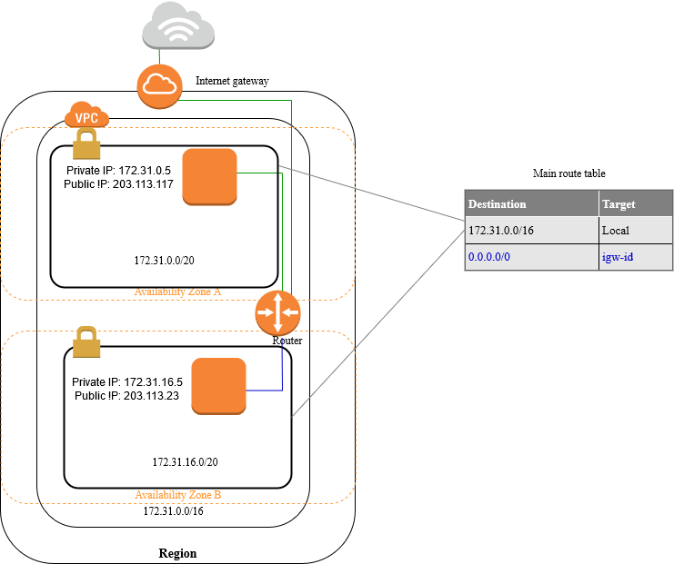
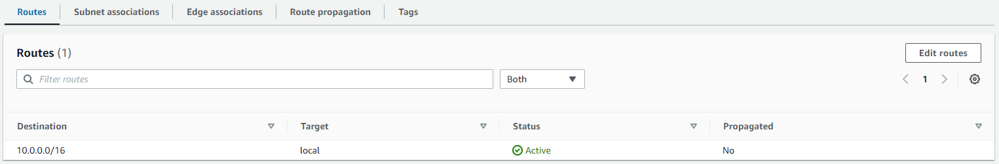
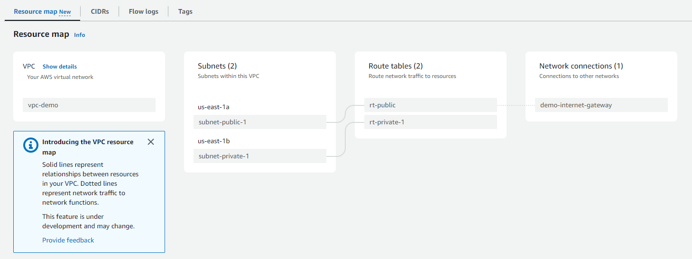
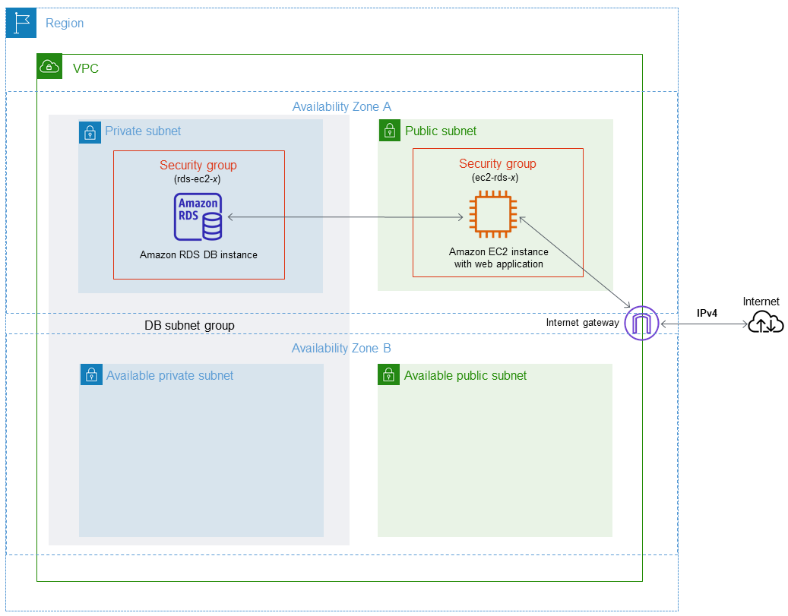
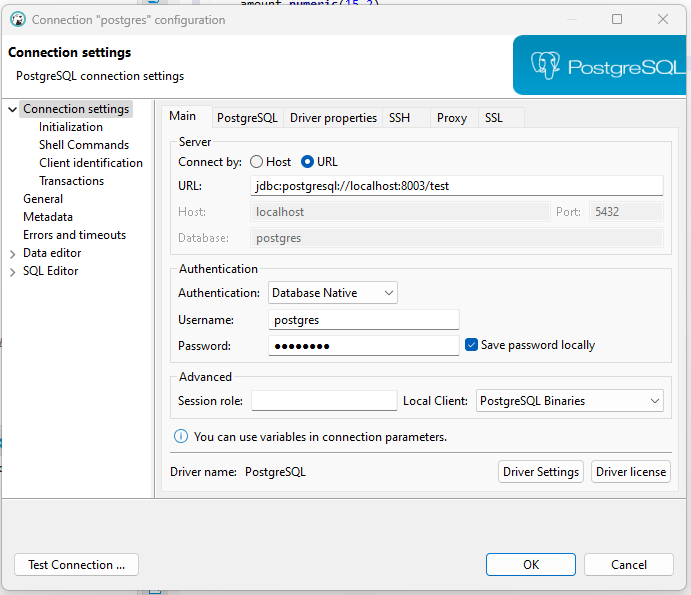
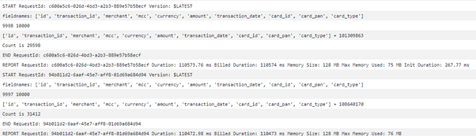
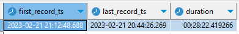
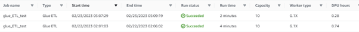
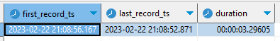

# allaboutaws
Useful Aws Tutorials and Documentations

## Prerequisite 
The below examples are experimented in `AWS Academy Leaner Lab`. Hence do **configure** your own IAM roles/users to allow the use of the various AWS resources.

We will be using the following for the creation of AWS services:
- IAM role
    - asd
- PEM file
    - `EC2` -> `Network & Security` -> `Key Pairs` -> `Create key pair`
        - **Name:** cs301-aws-generic
        - **Private key file format:** .pem

## Examples 
<details>
<summary>Public and Private Subnet </summary>

  <!-- weight = "" height = "" -->

### Summary
We will be creating a 
- 1 vpc *(IP address of 10.0.0.0/16)* to allow **65534** hosts (256*256 - 2)
- 1 public subnet *(IP address of 10.0.1.0/24)* to allow **254** hosts (256 - 2)
- 1 private subnet *(IP address of 10.0.2.0/24)* to allow **254** hosts (256 - 2)

The key difference between a private and a public subnet is that private subnet associated with a route table that **doesn’t have a route to an internet gateway**.

### Implementation Steps

**NOTE:** You can click **VPC and more** to create a new VPC with 2 public and 2 private subnet configured automatically for you. Click [here](./static/aws-create-vpc-and-more.png) to see the visualisation!


1. Create VPC
    - `VPC (service)` -> `Virtual private cloud (left navigation menu)` -> `Your VPCs` -> `Create VPC`
        - **Name:** vpc-demo
        - **IPv4 CIDR:** 10.0.0.0/16
2. Create Subnet for both private and public
    - `VPC (service)` -> `Virtual private cloud (left navigation menu)` -> `Subnets` -> `Create subnet`
        - **VPC ID:** <select your VPC from (1)> 
        - **Subnet name:** subnet-public-1, subnet-private-1
        - **Availability Zone:** us-east-1a , us-east-1b *(you can allow AWS to choose for you but I assign manually for better control of resources later on)*
        - **IPv4 CIDR block:** 10.0.1.0/24 , 10.0.2.0/24 respectively
        - CLICK `add new subnet` to add more
3. Create a new Internet gateways
    - `VPC (service)` -> `Virtual private cloud (left navigation menu)` -> `Internet gateways` -> `Create internet gateway`
        - **Name tag:** demo-internet-gateway
    - Click on your gateway, from `Actions` -> `Attach to VPC` 
        - **Available VPCs**: <select your VPC from (1)> 
4. Create Route tables for your private and public subnets
    - Do note that a default route table is already attached during the creation of VPC. In this case we will be using the **default route table for the private subnet** since it is not routed to any internet gateway.
        
    - Change the name of the default route table for the private subnet
        - `VPC (service)` -> `Virtual private cloud (left navigation menu)` -> `Route tables`
        - Find the default route table that is under your vpc and hover your mouse-tip to the `-` under the `Name` column.
            - **Edit Name:**: rt-private-1
    - Create route table for public subnet
        - `VPC (service)` -> `Virtual private cloud (left navigation menu)` -> `Route tables` -> `Create route table`
            - **Edit Name:**: rt-public
            - **VPC:** <select your VPC from (1)> 
        - Once created, click on `Edit Routes` and `Add route`
            - **Destination:** 0.0.0.0/0
            - **Target:** Click `Internet Gateway` and you will see the gateway that you have attached in (3)
5. Change the route table for your public subnet *(private subnet should already be attached to the default route table which you renamed at (4))*
    - `VPC (service)` -> `Virtual private cloud (left navigation menu)` -> `Subnets`
    - Click on your public subnet *(subnet-public-1)*
    - Under `Route table`, click `Edit route association` and change the route table ID
        - **Route table ID:**: rt-public
6. Enable DNS hostname in VPC - allow public DNS hostname (if not you have to create eastic IP address for every resource)
    - Check this StackOverFlow [here](https://stackoverflow.com/questions/20941704/ec2-instance-has-no-public-dns)
    - `VPC (service)` -> `Virtual private cloud (left navigation menu)` -> `Your VPCs`
    - Click on your VPC and `Actions` -> `Edit VPC settings`
    - Check Enable DNS hostname
7. Auto-assign public IPv4 address for your public subnet
    - `VPC (service)` -> `Virtual private cloud (left navigation menu)` -> `Subnets`
    - Click on your public subnet and `Actions` -> `Edit subnet settings`
    - check `Enable auto-assign public IPv4 address`
8. YAY! you have successfully setup a private and a public subnet under your own VPC! You can visualise the resource map by clicking on your `VPC`. From the image below, you can see that the two different subnets are associated with different route table. Only the public subnet can access the internet gateway.
    


</details>

<details>
<summary>Database Creation (private) and Connections</summary>

### Summary



We will be creating a private PostgreSQL DB RDS instance (Learnerlab do not have access AWS Aurora) and will be connecting to it through our local laptop using a proxy (EC2). 

**NOTE:** Do setup your vpc and subnets as from `Public and Private Subnet` section as we will be using them in our implementation.

### Implementation Steps
1. Create Proxy (EC2) in public subnet
    - `EC2 (service)` -> `Instances (left navigation menu)` -> `Instances` -> `Launch instances`
        - **Name:** ec2-proxy
        - **Amazon Machine Image (AMI):** Amazon Linux 2 AMI (free tier eligible)
        - **Instance type:** t2.micro (free tier eligible)
        - **Key pair name:** cs301-aws-generic *(check prerequisite)*
        - Click **Edit** under Network settings
        - **VPC:** vpc-demo *(created from `Public and Private Subnet` section)*
        - **Subnet:** subnet-public-1 *(created from `Public and Private Subnet` section)*
        - **Auto-assign public IP:** Enable
        - **Firewall (security groups):** Create security group (selected) 
        - **Security group name:** proxy-ec2-sg
2. Create DB subnet group 
    - Before that, create another private subnet as DB subnet group need to cover at least 2 AZs. Follow `Public and Private Subnet` section
    - `RDS (service)` -> `Subnet groups (left navigation menu)` -> `Create subnet group`
        - **Name:** private-db-subnet
        - **VPC:** vpc-demo *(created from `Public and Private Subnet` section)*
        - **Availability Zones:** us-east-1b, us-east-1c *(where our private subnets are)*
        - **Subnets:** 10.0.2.0/24, 10.0.3.0/24 *(created from `Public and Private Subnet` section)*
3. Create RDS instance
    - `RDS (service)` -> `Databases (left navigation menu)` -> `Create database`
        - **Engine type:** PostgreSQL
        - **Templates:** Free Tier
        - **DB instance identifier:** demo-db
        - **Master username:**: postgres **(Unchanged)**
        - **Master password:**: < password >
        - Under `Connectivity`
        - **Compute resource:**: Don't connect to an EC2 compute resource (selected) -> **we will manually set up**
        - **Virtual private cloud (VPC):** vpc-demo *(created from `Public and Private Subnet` section)*
        - **DB subnet group:** private-db-subnet *(created in step 2)*
        - **Public access:** No
        - **VPC security group (firewall):** private-db-sg
        - Under `Additional configuration` (Optional)
            - **Initial database name:** < db name >

4. Modify Security Group for your proxy and RDS
    - `EC2 (service)` -> `Network & Security (left navigation menu)` -> `Security Groups`
        - Click on the security group under the name you have assigned for your proxy in step 1 **(proxy-ec2-sg)**
            - Under `Outbound rules`, click on `Edit outbound rules` and add
                - **Type:** Custom TCP *(or you can just specific your database and it will update the port range as well)*
                - **Port Range:** 5432 *(PostgreSQL - change accordingly to your db)*
                - **Destination:** private-db-sg *(Security group created in step 3)* *(Alternatively, you can specify the rds instance IP directly)*
        - Click on the security group under the name you have assigned for your RDS in step 3 **(private-db-sg)**
            - Under `Inbound rules`, click on `Edit inbound rules`
                - remove existing rules and add:
                - **Type:** Custom TCP *(or you can just specific your database and it will update the port range as well)*
                - **Port Range:** 5432 *(PostgreSQL - change accordingly to your db)*
                - **Destination:** proxy-ec2-sg *(Security group of ec2)* *(Alternatively, you can specify the ec2 instance IP directly)*
    - This allows your proxy to add as a bastion host to connect with the RDS in your private subnet
5. Test Connection using Dbeaver
    - Establish **SSH Tunneling** to connect the RDS instance in the private subnet to your EC2 to local machine
        ```sh
        ssh -i testinstance.pem -4 -N -L randomlocalport:DB-endpoint:DB-port username@PublicIPAddress

        # For example
        ssh -i cs301-aws-generic.pem -4 -N -L 8003:demo-db.cmkdoo9tbsig.us-east-1.rds.amazonaws.com:5432 ec2-user@ec2-34-200-231-59.compute-1.amazonaws.com
        ```
        - Explaination of command: [here](https://explainshell.com/explain?cmd=ssh+-i+testinstance.pem+-4+-N+-L+randomport%3ADB-endpoint%3ADB-port+username%40PublicIPAddress)
    - You can check if the tunnel is established by listening to the port that you set above:
        ```sh
        netstat -ntap tcp | grep -i LISTEN | grep portnumber

        # For example
        netstat -ntap tcp | grep -i LISTEN | grep 8003

        # Sample output
        # tcp        0      0 127.0.0.1:8003          0.0.0.0:*               LISTEN      105/ssh
        ```
        - Explaination of command: [here](https://explainshell.com/explain?cmd=netstat+-ntap+tcp+%7C+grep+-i+LISTEN+%7C+grep+8003)
    - You can then connect to the rds instance through the local port you have set
        

</details>


<details>
<summary>CS301 Research Implementation </summary>

### Summary
The research focuses on evaluating the efficiency of processing large csv files and inserting into a Postgres database through:
1. Recurring Lambda function
2. AWS GLUE

Since this is just a research, there are quite alot of hard-coded values which we should not be doing in real production!

### Implementation Steps (Brief)
1. Recurring lambda function (reference [here](https://medium.com/swlh/processing-large-s3-files-with-aws-lambda-2c5840ae5c91))
    - Lambda does not provide 3rd party libraries out of the box. We have to zip the files and upload the lambda codes.
    - Zip the psycopg2 folder of your choice together ([awslambda-psycopg2 Github repo](https://github.com/jkehler/awslambda-psycopg2)) with the lambda handler code found [here](./scripts/research_lambda_handler.py)
    - Remember to increase the default time limit to 15 minutes.
2. AWS Glue
    - Attached an Amazon S3 endpoint to the VPC. Check [here](https://docs.aws.amazon.com/glue/latest/dg/connection-S3-VPC.html) for more details.
    - Create Crawler to get s3 files and process columns
    - Establish connection with Postgres database and create Crawler as well
    - Copy/upload the python script and create job. [Glue script](./scripts/research_glue_etl_test.py)

### Results - Lambda
The usual practice of ingesting data from a large CSV file is to send records to a message queue and allow the processing of each record to run asynchronously. The team simulated this environment by invoking an AWS Lambda function to open the CSV file and create a generator to receive each row. These rows are processed and sent to the database. 

As each lambda function has a maximum duration limit of 15 minutes, the function regularly checks if the remaining time is more than the stipulated time (defined by us) after each row retrieval. Another lambda function will be invoked asynchronously with the same event object and the additional offset value. This offset value helps to determine the last position of the processed records. 

<p align="center" width="100%">
    
    
</p>

The whole process took approximately 28 minutes for 478,817 records. The team reckons that the duration will increase as the processing algorithm gets more complex. 

### Results - Glue
The entire CSV file is processed and only sent to the database once all algorithms run successfully. The insertion of  478,817 records took approximately 3 seconds and the glue job took approximately 3 to 5 minutes. 

<p align="center" width="100%">
    
    
</p>


</details>


## Resources and References
- [AWS - Creation of public and private subnet](https://www.1cloudhub.com/aws-vpc-101-creation-of-public-subnet-and-private-subnet-in-vpc-and-test-connectivity/)
- [AWS - Glue: Crawling an Amazon S3 data store using a VPC endpoint](https://docs.aws.amazon.com/glue/latest/dg/connection-S3-VPC.html)
- [AWS - RDS: Accessing db instance in a VPC](https://docs.aws.amazon.com/AmazonRDS/latest/UserGuide/USER_VPC.Scenarios.html#USER_VPC.Scenario1)
- [AWS - VPC,EC2: no public dns](https://stackoverflow.com/questions/20941704/ec2-instance-has-no-public-dns)
- [Connect private rds instances using dbeaver](https://fitdevops.in/connect-to-private-rds-instances-using-dbeaver/)
- [Connect postgresql via bastion](https://gist.github.com/kshailen/0d4f78596b0ab12659be908163ed1fc2)
- [awslambda-psycopg2](https://github.com/jkehler/awslambda-psycopg2)
- [Processing-large-s3-files-with-aws-lambda](https://medium.com/swlh/processing-large-s3-files-with-aws-lambda-2c5840ae5c91)
- [Subnet Calculator](https://www.davidc.net/sites/default/subnets/subnets.html)
- [Youtube - Subnet Mask Explained](https://www.youtube.com/watch?v=s_Ntt6eTn94)


